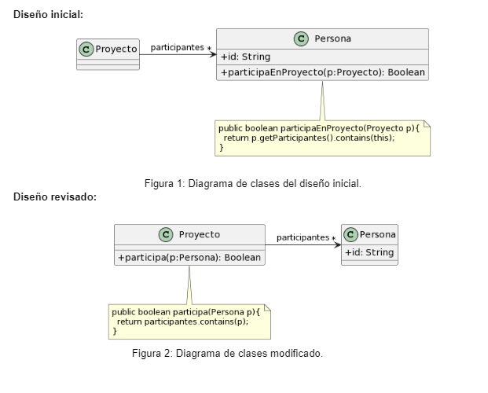
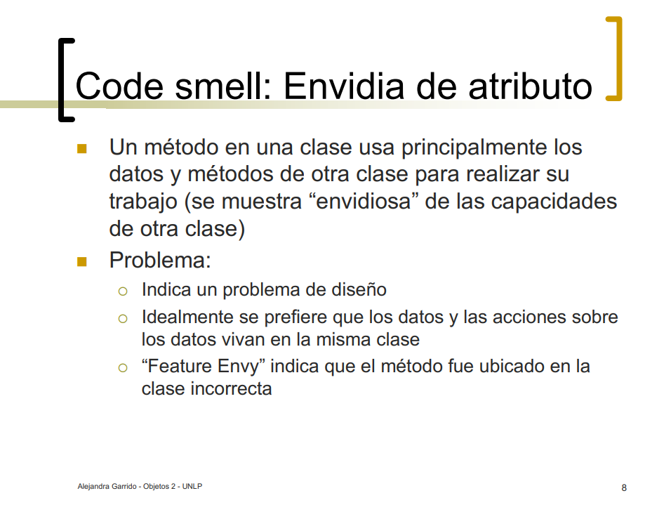
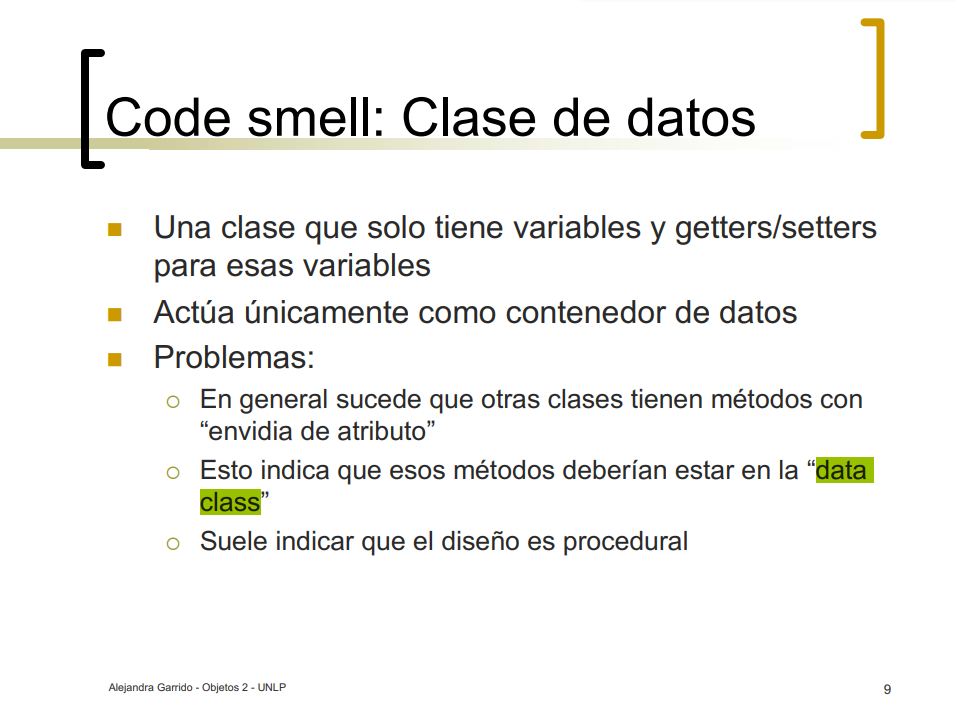

### 1.1 Protocolo de Cliente
La clase Cliente tiene el siguiente protocolo. ¿Cómo puede mejorarlo? 

```java
/** 
* Retorna el límite de crédito del cliente
*/
protected double lmtCrdt() {...

/** 
* Retorna el monto facturado al cliente desde la fecha f1 a la fecha f2
*/
protected double mtFcE(LocalDate f1, LocalDate f2) {...

/** 
* Retorna el monto cobrado al cliente desde la fecha f1 a la fecha f2
*/
protected double mtCbE(LocalDate f1, LocalDate f2) {...
```

**Code smells:** 
1. Nombres poco descriptivos

*Solucion*: 
```java
/** 
* Retorna el límite de crédito del cliente
*/
protected double limiteDeCredito() {...

/** 
* Retorna el monto facturado al cliente desde la fecha f1 a la fecha f2
*/
protected double montoFacturado(LocalDate fechaInicio, LocalDate fechaFin) {...

/** 
* Retorna el monto cobrado al cliente desde la fecha f1 a la fecha f2
*/
protected double montoCobrado(LocalDate fechaInicio, LocalDate fechaFin) {...
```

Bad smells: metodos con nombres poco descriptivos.
Mejoras: en cada metodo con nombre poco descriptivo aplicar refactoring: Rename methood, y en cada
lugar donde se llame a esos metodos tambien cambiar el nombre de la llamada.

- Nombre de mensaje que revela la intención. El nombre del mensaje comunique lo que se quiere hacer. 
- Los nombres de las variables deben indicar su rol. Debe quedar claro el rol que cumplen en el método / clase.

----  

### 1.2 Participación en proyectos 
Al revisar el siguiente diseño inicial (Figura 1), se decidió realizar un cambio para evitar lo que se consideraba un mal olor. El diseño modificado se muestra en la Figura 2. Indique qué tipo de cambio se realizó y si lo considera apropiado. Justifique su respuesta.



**Code smells:**
1. Feature Envy
2. Data class

Los cambios que se realizaron fue que se delego a la clase **"Proyecto"** determinar si una persona participa o no en el, lo considero apropiado ya que es una solución con respecto a los malos olores _Feature Envy_ y _Data class_ que se encuentran en el diseño de la Figura 1, ya que en ese diseño la clase **"Proyecto"** esta actuando nada mas como una clase de datos y la clase **"Persona"** como una clase dios




----  


### 1.3 Cálculos 
Analice el código que se muestra a continuación. Indique qué code smells encuentra y cómo pueden corregirse.						

```java
public void imprimirValores() {
	int totalEdades = 0;
	double promedioEdades = 0;
	double totalSalarios = 0;
	
	for (Empleado empleado : personal) {
		totalEdades = totalEdades + empleado.getEdad();
		totalSalarios = totalSalarios + empleado.getSalario();
	}
	promedioEdades = totalEdades / personal.size();
		
	String message = String.format("El promedio de las edades es %s y el total de salarios es %s", promedioEdades, totalSalarios);
	
	System.out.println(message);
			
}
```

**Code smells:**  
   1. Método largo: el método esta realizando multiples tareas (sumar las edades, sumar los salarios, calcular el promedio de edades e imprimir esos valores).  
   Mal olor en metodo **"imprimir valores()"**.  
   Se podría solucionar creando distintos métodos que hagan cada una de esas cosas por separado, aplicandodo refactoring extract method.

*Solucion Codigo del refactoring aplicado*:

```java
public void imprimirValores() {
	double promedioEdades = calcularPromedioEdades();
	double totalSalarios = calcularTotalSalario();
		
	String message = String.format("El promedio de las edades es %s y el total de salarios es %s", promedioEdades, totalSalarios);
	
	System.out.println(message);
}
public double calcularPromedioEdades() {
	int totalEdades = 0;
	double promedioEdades = 0;
	
	for (Empleado empleado : personal) {
		totalEdades = totalEdades + empleado.getEdad();
	}
	promedioEdades = totalEdades / personal.size();
		
	return promedioEdades
}
public double calcularTotalSalario() {
	double totalSalarios = 0;
	
	for (Empleado empleado : personal) {
		totalSalarios = totalSalarios + empleado.getSalario();
	}
		
	return totalSalarios
}
```

**Code smells:**  
   2. Reinvento la rueda: ya existen programadas funciones para sacar promedios y totales con .streams.  
   Mal olor en metodo los for de calcularTotalSalario() y calcularPromedioEdades().  
   Se podría solucionar reemplazando fors por streams.

*Solucion Codigo del refactoring aplicado*:

```java
public void imprimirValores() {
	double promedioEdades = calcularPromedioEdades();
	double totalSalarios = calcularTotalSalario();
		
	String message = String.format("El promedio de las edades es %s y el total de salarios es %s", promedioEdades, totalSalarios);
	
	System.out.println(message);
}
public double calcularPromedioEdades() {	
	return personal.stream()
		.mapToint(e -> e.getEdad())
		.average();
}
public double calcularTotalSalario() {
	return personal.stream()
		.mapToDouble(e -<> e.getSalario())
		.sum();
}
```
**Code smells:**  
   3. temporary fields: hay atributos que solo sirven para almacenar temporalmente  
   Mal olor las variables message, promiedioEdades y totalSalarios.  
   Se podría solucionar removiendo esas variables.

*Solucion Codigo del refactoring aplicado*:

```java
public void imprimirValores() {
	System.out.println(String.format("El promedio de las edades es %s y el total de salarios es %s", calcularPromedioEdades(), calcularTotalSalario()));
}
public double calcularPromedioEdades() {	
	return personal.stream()
		.mapToint(e -> e.getEdad())
		.average();
}
public double calcularTotalSalario() {
	return personal.stream()
		.mapToDouble(e -<> e.getSalario())
		.sum();
}
```
